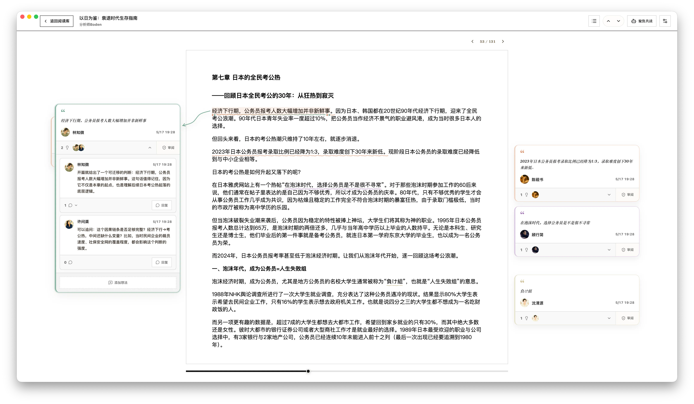

<p align="center">
  
</p>

# Yomitomo

Yomitomo 是一个本地优先的 AI 伴读桌面应用。Electron 桌面端负责网页文章、EPUB 电子书与 PDF 导入、阅读库、批注、评论、批注沉淀、阅读器聊天、微信读书同步、LLM provider 管理和阅读助手；Astro 官网负责产品介绍、下载入口、双语文档和社交预览。

当前可以从 [yomitomo.app](https://yomitomo.app) 或 [GitHub Releases](https://github.com/xingkaixin/yomitomo/releases) 下载 macOS Apple Silicon 和 Windows x64 安装包。项目仍处于 early alpha 阶段。

## 核心能力

- 网页文章导入：从 URL 抽取正文、标题、作者、站点信息和图片。
- EPUB 电子书导入与阅读：导入本地 EPUB 文件，保存章节、封面和原始电子书文件。
- PDF 导入与阅读：导入本地 PDF 文件，支持目录、选区、高亮、批注和助手共读。
- 桌面阅读器：目录、字号、宽度、高亮、全文搜索、阅读器聊天、悬浮工具栏、双侧笔记栏、选区快捷键、方向键翻页和批注导航；网页文章支持双语翻译。
- 文本批注：高亮、批注类型、想法线程、讨论评论、沉淀发布和 `@助手` 触发；讨论与沉淀支持动效与音效反馈（可在设置中开关）。
- 主动精读：选择一个或多个阅读助手，让 AI 围绕网页文章、EPUB 章节或 PDF 文档生成批注，并复用本地阅读记忆、角色视角和本地化展示。
- 微信读书同步：配置 API key 后同步书籍笔记、想法和阅读统计。
- 阅读库：集中管理网页文章、电子书、批注、评论和原文链接。
- 界面与主题：中英文切换、黄昏靛蓝等多主题、手绘墨迹纸张与主题选择、统一 Toast 提示。
- 应用更新与数据管理：检查更新、查看版本更新说明、打开数据目录、查看日志、备份和还原本地数据库；macOS 安装包经签名与公证。
- 阅读统计：按文章、批注和讨论生成本地阅读趋势。
- 零遥测：阅读数据保存在本机，provider API key 通过系统 keyring 保存。

## 示例

### Electron 桌面端



## 项目结构

```text
apps/desktop       Electron 桌面端，包含 main、preload、renderer
apps/web           Astro 产品官网，包含 landing page、下载入口、SEO 和静态产品图
packages/ai        LLM provider 调用、模型输入预算和 AI 生成链路
packages/core      业务核心逻辑，包括批注、评论、阅读统计、EPUB/PDF 索引和阅读器 DOM 纯逻辑
packages/reader-ui 桌面阅读器 React UI、样式、工具和 hooks
packages/shared    共享类型、provider preset、agent preset、ID、哈希、文本锚定、PDF 和微信读书协议类型
assets             项目静态资源
```

## 技术栈

- 包管理器：`pnpm@11.x`
- 构建编排：Turbo
- 语言：TypeScript，ESM
- 桌面端：Electron 41、electron-vite、React 19、Vite 8、Tailwind CSS 4
- 官网：Astro 6、React 19、Vite 7、Tailwind CSS 4
- 本地数据库：SQLite、better-sqlite3、Drizzle ORM
- 测试：Vitest
- Lint / Format：通过 Turbo 运行 oxlint、oxfmt

## 从源码运行

### 环境准备

- Node.js
- pnpm 11
- macOS 桌面开发环境
- Xcode Command Line Tools，供 `better-sqlite3` native rebuild 使用


安装依赖：

```bash
pnpm install
```

验证桌面端 native 依赖边界：

```bash
pnpm --filter @yomitomo/desktop native:verify
```

升级 Electron 或 `better-sqlite3` 后运行该命令，确认普通 Node/Vitest 与
Electron 应用分别使用各自的 `better-sqlite3` native root。

### 运行桌面端

```bash
pnpm --filter @yomitomo/desktop dev
```

桌面端启动后会：

- 在 Electron `userData` 目录保存 `yomitomo.sqlite`。
- 提供用户、provider、助手、阅读库、统计和日志视图。
- 支持从阅读库导入网页 URL、本地 EPUB 文件或本地 PDF 文件。

### 运行官网

```bash
pnpm --filter @yomitomo/web dev
```

官网本地开发用于预览 landing page、下载链接、SEO 元信息和产品静态图。

### 打包发布产物

从仓库根目录打包默认发布产物：

```bash
pnpm make
```

`pnpm make` 会生成 macOS arm64 桌面端安装包，产物输出到 `dist/app/mac-arm64`，包含 electron-builder 生成的 `dmg` 和 `zip`。

也可以按目标单独打包：

```bash
pnpm make:app:mac-arm
pnpm make:app:win-x64
```

`pnpm make:app:win-x64` 会生成 Windows x64 NSIS 安装包，产物输出到 `dist/app/win-x64`。公开分发前需要按发布渠道配置 macOS 签名、公证和 Windows 签名策略。

推送 `vX.Y.Z` tag 会触发 GitHub Release 工作流，构建并上传 macOS `.dmg` / `.zip`、Windows `.exe`、blockmap 和 `latest*.yml` 更新元数据。

### 本地阅读和 AI 配置

1. 启动桌面端。
2. 在「供应商」页创建 LLM provider，填写 base URL、API key 和模型名。
3. 在「助手」页创建批注助手或审核助手，并关联 provider。
4. 在「阅读库」导入网页 URL、本地 EPUB 文件或本地 PDF 文件。
5. 打开文章或电子书，选中文本创建高亮和批注，或在「助手精读」里选择阅读助手生成 AI 批注。
6. 如需同步微信读书，在「设置」里配置微信读书 API key 后同步笔记和阅读统计。

### 同时启动 workspace 开发任务

```bash
pnpm dev
```

`pnpm dev` 会通过 Turbo 启动各 workspace 的开发任务。

## 常用命令

```bash
pnpm dev:app
pnpm dev:web
pnpm lint
pnpm lint:fix
pnpm format
pnpm format:check
pnpm typecheck
pnpm test
pnpm build
```

## 数据

- 桌面端通过 SQLite 保存用户、provider、助手、文章、PDF 元数据、微信读书同步数据、批注、评论和阅读进度。
- provider API key 通过系统 keyring 保存，数据库只保留 key 引用和 provider 配置。
- 从网页 URL 导入文章时，桌面端会读取目标页面内容并生成本地文章记录。
- 从本地导入 EPUB 时，桌面端会保存原始电子书文件、章节索引和本地文章记录。
- 从本地导入 PDF 时，桌面端会保存原始 PDF 文件、页面信息和本地文章记录。

## 分层约定

- `packages/shared` 放共享类型、provider preset、agent preset、ID/哈希、文本锚定、PDF 和微信读书协议类型。
- `packages/core` 放批注、评论、阅读统计、EPUB/PDF 索引和阅读器 DOM 相关纯逻辑。
- `packages/ai` 放 provider 调用、模型输入预算、AI 批注和 EPUB/PDF 阅读上下文。
- `packages/reader-ui` 放桌面阅读器 React UI、样式、工具和 hooks。
- `apps/desktop/src/main` 放 Electron 主进程、SQLite store、LLM 调用、文章/电子书/PDF 导入、微信读书同步和日志。
- `apps/desktop/src/renderer/src/app-*` 放桌面端阅读库、统计、设置和日志 UI。
- `apps/web/src` 放 Astro 官网页面、产品轮播和全局样式，下载链接从 `apps/desktop/package.json` 的版本号生成。

## 提交前检查

```bash
pnpm lint
pnpm format:check
pnpm typecheck
pnpm test
pnpm build
```

## 开源许可证

Yomitomo 使用 [MIT](LICENSE) 许可证发布。

Copyright 2026 Yomitomo contributors.

第三方生产依赖和 vendored 组件的许可证清单见 [THIRD_PARTY_NOTICES.md](THIRD_PARTY_NOTICES.md)。清单可通过以下命令重新生成：

```bash
pnpm licenses:generate
```
